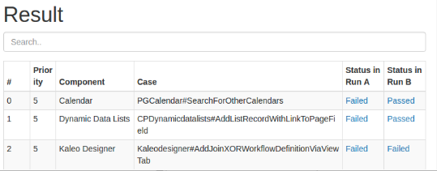
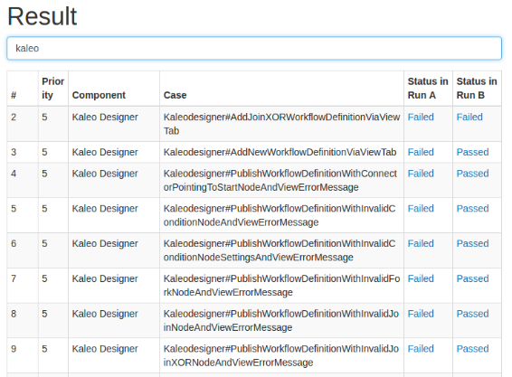

# Testray Screenshot
Only for fixpack team !!

# 为什么要做这个扩展
现在Testray已经做的很好了，可以Compare，可以按工作流Assign，可以全局Search等等。

那么问题来了，因为它针对的是Liferay群体，所以对于某个Team（如CN FixPack Team）使用起来略显臃肿，因为我们毕竟不会使用所有的功能，而且频繁的页面跳转确实有些烦躁（尤其是公司这个破网）。

所以开发这个扩展的初衷总结一句话就是，为了”取其精华去其糟粕“,节省一些时间。

时间就是金钱，我的朋友。

# 当前提供的功能
## Compare Result快照（In Progress）
可以截取某个Compare Result快照并暂存，支持多重快照。

## 快照中的Result Search
可以在某一个快照中Search。

## ~~同步Google Doc（Pending)~~
~~与Google Doc文档进行同步~~

## DEMO

